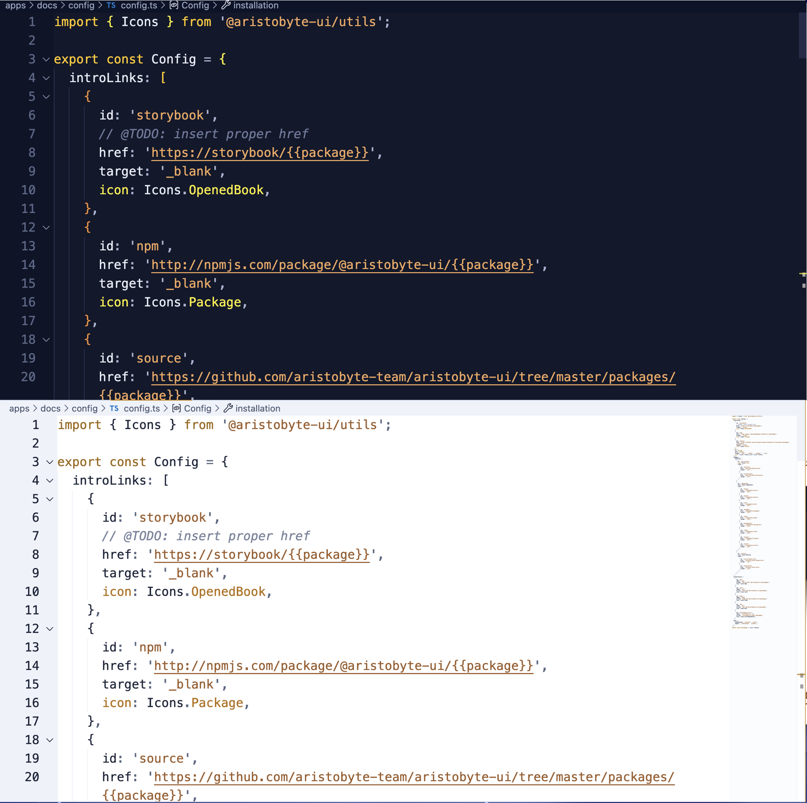

# Accessibility

## Design goals

- High readability for long sessions
- Distinct semantic color groups
- Clear focus and selection states

## User recommendations

- Enable semantic highlighting:

```json
{
  "editor.semanticHighlighting.enabled": true
}
```

- Increase editor font size and line height if needed.
- Use editor zoom controls for quick readability adjustments.

## Contrast checks

When replacing colors, verify:

- Foreground/background readability in editor text
- Distinction between comments, keywords, strings, and errors
- Active line number and cursor visibility

## Accessibility issue reporting

Use the issue tracker and include:

- VS Code version
- OS
- Theme variant
- Screenshots and exact color keys


