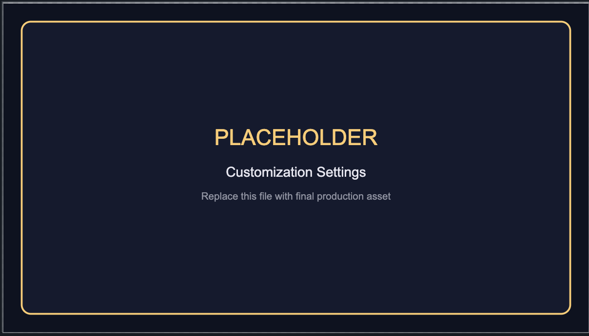

# Customization

AristoByte is optimized as a complete editor look, but you can layer user settings when needed.

## Override workbench color keys

```json
{
  "workbench.colorCustomizations": {
    "editorLineNumber.activeForeground": "#FFCB6B",
    "editorCursor.foreground": "#FFCB6B"
  }
}
```

## Override token colors

```json
{
  "editor.tokenColorCustomizations": {
    "textMateRules": [
      {
        "scope": "comment",
        "settings": {
          "foreground": "#7A819A",
          "fontStyle": "italic"
        }
      }
    ]
  }
}
```

## Keep consistency across machines

- Use VS Code Settings Sync.
- Pin the extension version in managed environments when needed.


