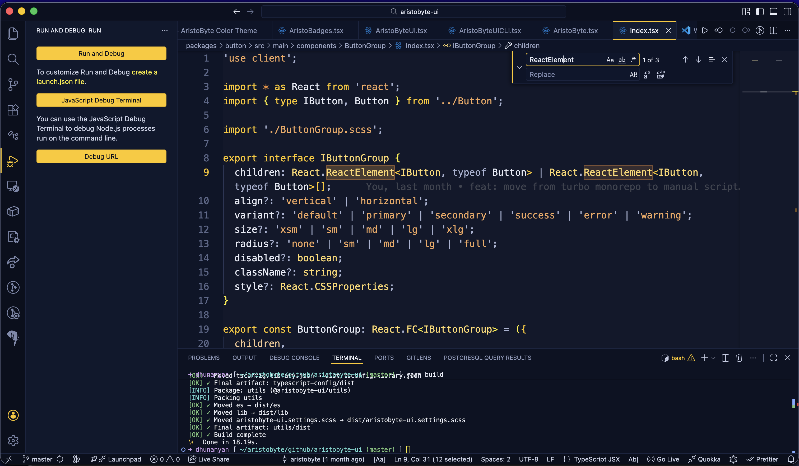

# Overview

AristoByte Color Theme delivers a focused editor experience for long coding sessions with clear syntax contrast and branded UI accents.

## What is included

- `AristoByte Dark`
- `AristoByte Midnight`
- `AristoByte Dusk`
- `AristoByte High Contrast Dark`
- `AristoByte OLED`
- `AristoByte Light`
- `AristoByte Soft Light`
- `AristoByte High Contrast Light`

## End-user dashboard tabs

Inside the extension page in VS Code, open the **Walkthrough** to access:

- Overview
- Installation
- Customization
- Accessibility
- Troubleshooting

## Quick links

- Installation: `docs/INSTALLATION.md`
- Usage: `docs/USAGE.md`
- Customization: `docs/CUSTOMIZATION.md`
- Accessibility: `docs/ACCESSIBILITY.md`
- Troubleshooting: `docs/TROUBLESHOOTING.md`
- FAQ: `docs/FAQ.md`
- Support: `docs/SUPPORT.md`
- Privacy: `docs/PRIVACY.md`
- Website: <https://aristobyte.com>

## Screenshot

---

By AristoByte Team
