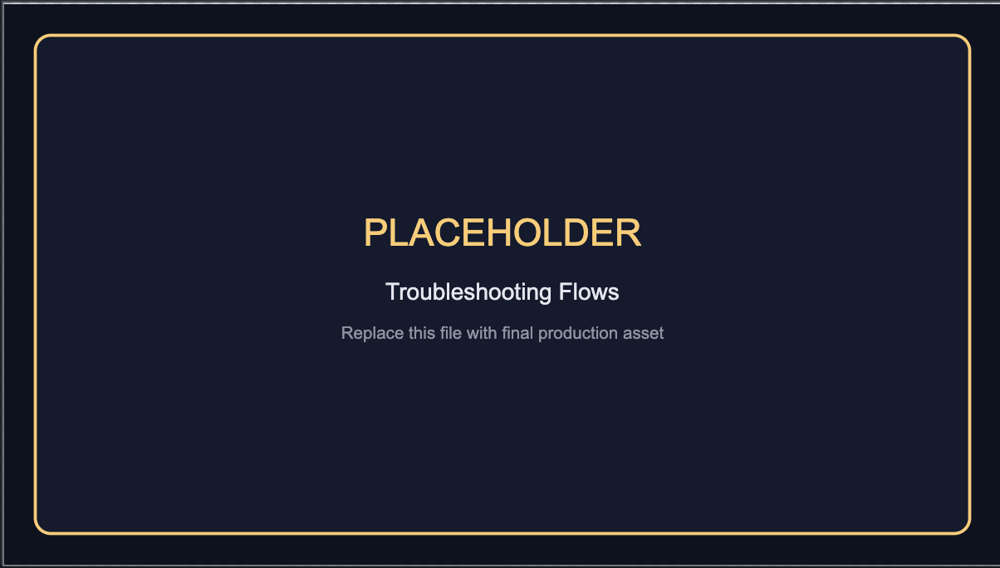

# Troubleshooting

## Theme does not appear in theme picker

- Confirm extension is installed and enabled.
- Reload window: `Developer: Reload Window`.
- Check extension host logs for install errors.

## Theme appears but colors do not apply

- Disable conflicting `workbench.colorCustomizations`.
- Disable other theme extensions temporarily.
- Ensure the selected theme is `AristoByte Dark` or `AristoByte Light`.

## Marketplace publish issues (maintainers)

- Confirm `VSCE_PAT` and `OVSX_PAT` are set in GitHub repository secrets.
- Confirm `package.json` version is incremented before merging to `master`.
- Confirm release tag for that version does not already exist.

## Broken icons/images in docs

- Replace placeholder assets listed in `docs/IMAGE_REPLACEMENT_MAP.md`.
- Keep filenames unchanged when possible to avoid broken links.

