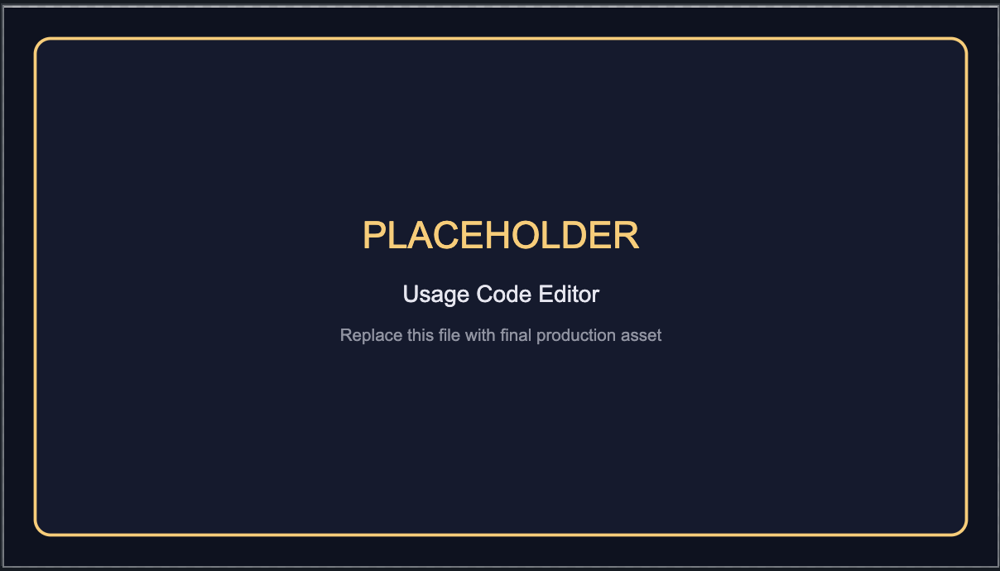

# Usage

## Change themes quickly

- Command Palette: `Preferences: Color Theme`
- Shortcut: `Ctrl+K Ctrl+T` (Windows/Linux) or `Cmd+K Cmd+T` (macOS)

## Inspect token colors

Use `Developer: Inspect Editor Tokens and Scopes` to inspect how syntax categories are themed.

## Recommended editor settings

```json
{
  "editor.semanticHighlighting.enabled": true,
  "editor.minimap.enabled": false,
  "editor.guides.indentation": true,
  "workbench.editor.enablePreview": false
}
```

## Suggested language coverage checks

Validate the theme on:

- TypeScript / JavaScript
- Python
- Go
- Rust
- JSON / YAML / TOML
- Markdown


